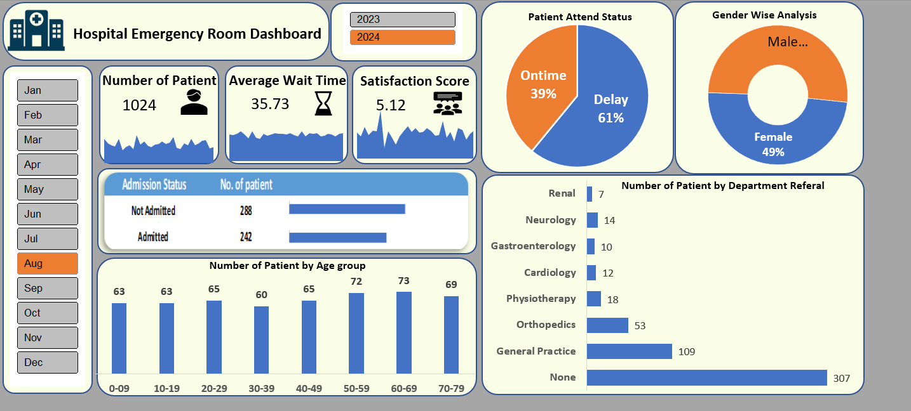

# 🏥 Hospital Emergency Room Dashboard (Excel)

📊 This project showcases an **interactive Excel dashboard** analyzing **Hospital Emergency Room (ER) data**.  
It was built using **Power Query**, **Power Pivot**, **Pivot Tables**, and **Pivot Charts** to transform raw data into actionable insights.  

---

## 🔹 Project Overview
The dashboard tracks key hospital performance metrics such as:
- **Number of Patients**
- **Average Wait Time**
- **Patient Satisfaction Score**
- **Admission Status**
- **Gender Distribution**
- **Age Group Analysis**
- **Department Referrals**

Users can filter the data by **Month** and **Year** using slicers for dynamic analysis.  

---

## 🔹 Tools & Techniques Used
- **Power Query** – Data cleaning & transformation  
  - Standardized gender values (M/F → Male/Female)  
  - Converted admission status (True/False → Admitted/Not Admitted)  
  - Created age groups and patient attend status  
- **Power Pivot** – Data modeling  
  - Created a **Calendar Table** using `List.Dates`  
  - Established relationships between tables for time-based analysis  
- **Pivot Tables & Pivot Charts** – For visualization  
- **Slicers** – For Month/Year filtering  
- **Dashboard Design** – KPIs, pie charts, bar charts, and cards  

---

## 🔹 Key Insights
- **61%** of patients experienced delays beyond the target wait time  
- Largest patient group: **Age 30–44**  
- **General Practice** received the most referrals  
- **Average Wait Time**: ~35 minutes  
- **Patient Satisfaction Score**: ~5/10  

---

## 🔹 Dashboard Screenshot
*(Upload your dashboard screenshot to the repo, then update the link below)*  

  

